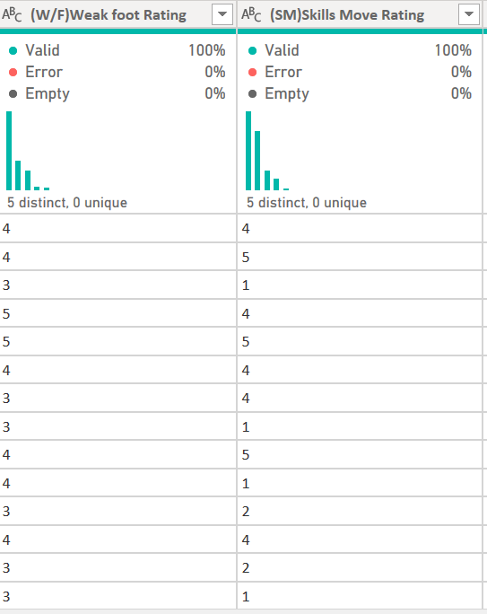
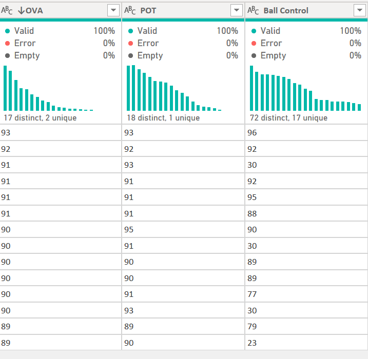

# FIFA21
Inspecting and Wrangling the FIFA 2021 Data Using PowerQuery

## Introduction
This is a #datacleaningchallenge organized by one Chinonso promise on twitter for people who are either data enthusiasts, newbies, intermediate, or pro data analyst to participate and test their prowess on a messy data set. You could use either tool for the cleaning challenge; PowerQuery, Excel, SQL, Payton or R. 

## Problem statement:
1.	Ensure that all the columns have the correct data type
2.	Numerical columns should be in a format suitable for further calculations and analysis

## Skills/ concept demonstrated:
I opted for power query for cleaning and here was the feature in cooperated:
- Whitespace
- Rename
- column quality and distribution
- remove duplicate
- data type
- replace value
- split, standard
- conditional column
- remove column
- filters

## Data cleaning process

The data set contains 18,979 rows and 77 columns of football players statistics and demography in 2021. The data set Is publicly available in **Kaggle** which contains data scrapped from **sofifa**. The data file also includes a data dictionary as well as a column name player url which contains a link to the player profile on sofifa to give the analyst further insight and full details of the player in view in case of missing information.

The first thing I did was to get rid of the space in every row, noticed every row was wide when I loaded the data set, so all I had to do was to go to view and untick the show whitespace and every row was back to normal size and also changed the column profiling base on top 1000 row to base on entire data set.

To ensure data quality during cleaning, understanding the data and identifying any inconsistencies, missing value or errors I started with the names. The 'Name’, 'LongName' and 'PlayerURL' columns all had information relating to players' names. The Name column has names written in the format, 'C. Ronaldo’, the LongName column had the initials, first name, middle name and last name of players in one place while the PlayerURL column had the players' full names embedded within the URL.  I resorted to extracting the full names of the players from the PlayerURL column.
Process: the column was split using the '/' delimiter at each occurrence which splatted the column leaving the name separated by '-' delimiters which was then cleaned by replace value ‘- ‘with “space” and then each letter was capitalized.
before                |        after
:--------------------:|:---------------------:
   |  

To enhance the value and usefulness for current analysis/visualization I added a column of their current age hence the data was collected 2 years ago 2021.I plus(+) the age column by 2 to give me their current age in 2023.
before                |        after
:--------------------:|:---------------------:
    |  

The 'Contract' column had inconsistent values and the wrong data type. The column had consistent values in the format, '23rd July 2020 on loan’, 'Free' and '2018 ~ 2024’.To tackle this issue, I had the column split using the space delimiter to give two columns containing the Contract start date and the Contract end date.I split the column using 'space' as the delimiter. Over 4 columns were created, got rid of all except the columns with Contract start and Contract end details. The columns were renamed, and the entries which were not in year format were replaced with 'Null’. This was done to allow the conversion of these two new columns to date types and also nullify records of players on 'Loan' and 'Free' from the Contracts column.
before                        |        after
:----------------------------:|:-------------------------:
  |  

'Positions'column i decided to remove it because there is another column bearing the 'Best Position' of each player. The 'Positions' column had the details in the 'Best Position' column in addition to the extra positions for players that had more than one position.

'Loan_date_end' has 97% empty rows. This is understandable as the total number of players on loan accounts for only 3% of the entire data. Only players on loan have values in this column. So, I decided to delete the column than replace the 97% with Null values.

'Weak_foot’, 'Skill_moves’, and 'International_reputation' columns all contain ratings on a scale of 1-5. The values in these columns had the special character '☆' in front and the data type was text, I replaced the special character with nothing, then converted the column data types from text to whole number.
before                  |        after
:----------------------:|:---------------------:
  |  

 'Height' and 'Weight' columns had inconsistencies in the units attached to their values. For the 'Height' column, the entries were in the format, '110cm’, 5’2" (feet & inches). I plan to convert the feet into inches and then later on into cm to make the column consistent. 
Procedure: first I split by delimiter “ ’ “ to get two column “Height1” & “Height2 to get” (feet and inches) (after research found out that 12inch make 1feet) meaning I would have to convert feet into inches. Next, I created conditional column IF “Height1” end with cm, output 1, else 12 then ok create new column “custom”. Then I had to also change the inch into cm (after research found that 0.393701 makes 1cm) then divide the inch by 0.393701 to get the cm. Went ahead first to create another conditional column IF “Height1” end with cm, output 1, else 0.393701 new column “custom1” was created. I removed the cm sign from height 1 using replace, then change data type to integer. Then multiply “height1” with “Custom” to create a new column “multiplication” then add “height2” and “multiplication” but before that I changed “height2” data type to integer and the “null” value replace with 0 and after adding a new column is created “addition”. Lastly you divide “addition” and “custom1” to give the final “division” column which would be your new height column with all being in cm now.
before                  |        after
:----------------------:|:-----------------------:
   |  

the 'Weight' column, entries were in the format, '65kg’, '112lbs’(pounds) so I decided to change them all to kg, the idea was to multiply all the lbs into kg and after research, found out that 0.453592 make one pound.
procedure: created conditional column and named it kg, used the if statement: IF weight ends with lbs, output 0.453592 else 1. We get a new column kg which all the lbs would be 0.453592 and the kg multiply by 1 which remains same number in kg. After that I used my filter to check numbers that does not end with lbs and kg to be sure of my column and it was clean enough. On my original weight column, I went back to replace value for kg and lbs and changed data type to integer to enable further calculations. So, I selected weight and kg, went to standard and click multiply to create a new column with all in kg then went ahead to delete the old weight and new kg column.
before                  |        after
:----------------------:|:-----------------------:
   |  

'Potential_rating’, 'Best_overall_rating' and 'Overall_rating' columns had values in the range of 1-99. Research about these column names showed that it is best for the values to be represented in percentages. To achieve this, these columns were first converted to integer data types, divided by hundred, and then subsequently converted to the percentage data type which multiplied all the values by a factor of 100.
before                      |        after
:--------------------------:|:----------------------------:
   |  

'Hits' column was stored as text data type but contained numbers (whole number and decimal number types) with the 'K' suffixes. For context, values like 1600 were stored as 1.6K. To get these values in numerical format, I created a conditional column which gave an output of 1000 for every row that has 'K' in the 'Hits' column and returned 1 if otherwise. After creating the conditional column, the 'K' in the 'Hits' column was replaced with space and the data type was converted to an integer. The final step involved creating a custom column whose formula was a multiplication of values in the conditional column and that in the Hits column. The custom column was renamed to 'Hits’, and the conditional column and original 'Hits' column were removed.
before                |        after
:--------------------:|:---------------------:
   |  

 "value" "wage" and "release clause" These three columns contains euro values in shortenend format where 1,500 euros was written as 1.5k and one million ,five hundred euros as 1.5m. The goal is to standardise the columns and convert to US dollars Hence the approach used was to dropped the euro symbol from all rows using find and replace, then split columns by m and k. First step was to create a New custom column which If column 1 contains m multiplies the figure by 1,000,000 then if column 1 contains k multiply by 1000 else return the figure on the original column , this else function handles the values , wages or release clause in hundreds having no K or M attached (some players earn as low as 500 euro wage ).This approach gives the full numeric form of the value , wage or release clause but wait! we are not done yet . To convert this full numeric digits to USD , the average euro to USD exchange rate of 1.183 was used as this was the average exchange rate as at 2021 which our data is based on.
before                |        after
:--------------------:|:---------------------:
 |  

## Conclusion
Cleaning the FIFA 21 data was a bit challenging. Despite the challenges encountered, the messy dataset was transformed into a state that renders it ready for use in analysis.

